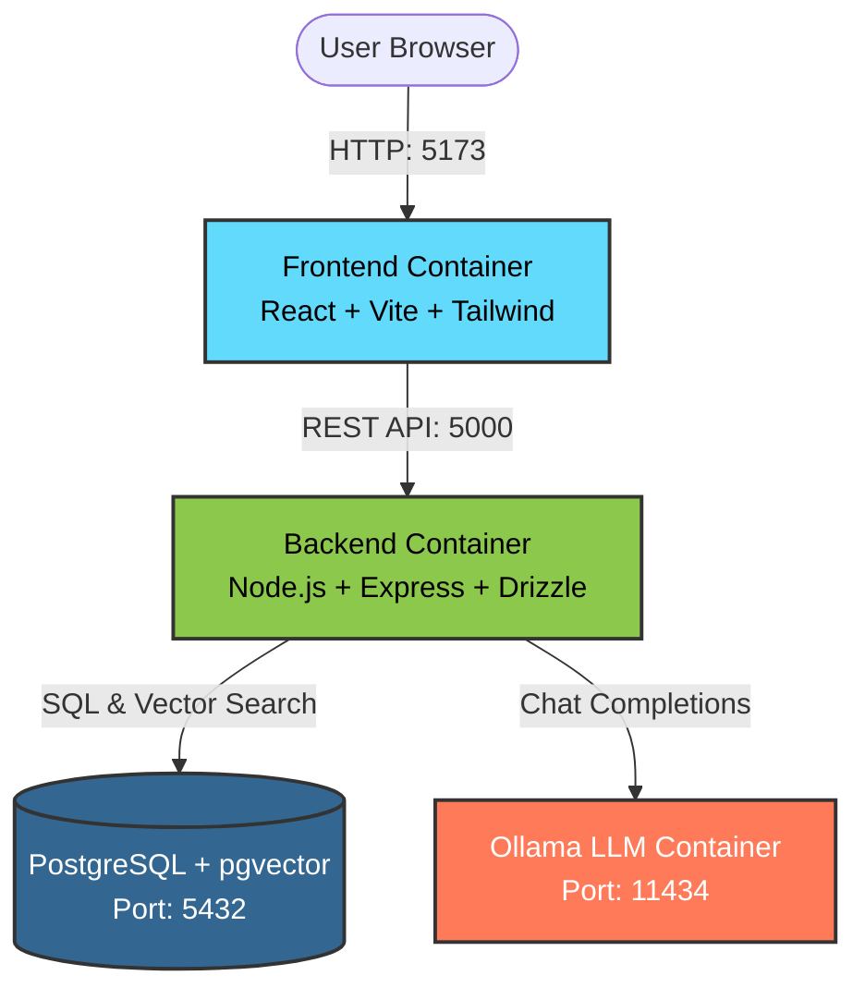
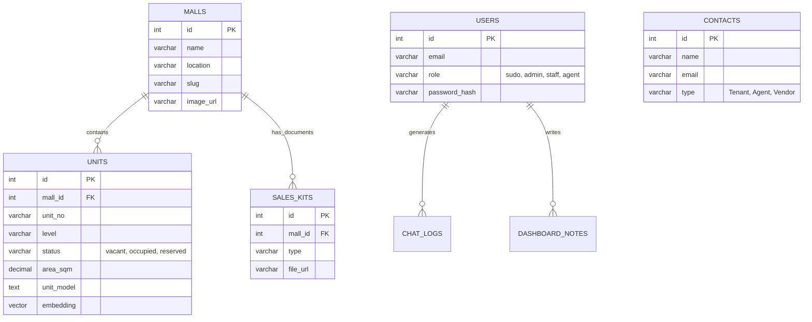
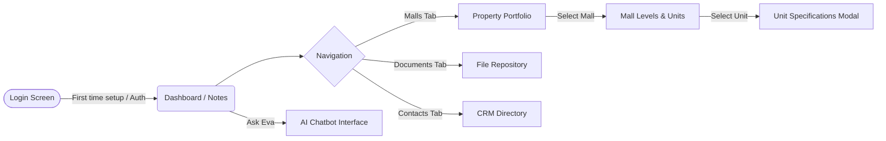

# Engwah Leasing Portal

## Project Title & Description
The **Engwah Leasing Portal** is a modern, enterprise-grade Property Management System (PMS) designed to streamline the operations of shopping malls and commercial real estate. It acts as a centralized source of truth for properties, units, tenant contacts, and marketing documents.

A standout feature of the portal is **Eva**, an integrated "Senior Commercial Leasing Analyst" AI assistant. Powered by a local LLM (Ollama) and retrieval-augmented generation (RAG) using `pgvector`, Eva provides context-aware insights, technical breakdowns, and instant answers to leasing queries directly based on the real-time database state.

---

## Visual Architecture & Flows

### System Architecture


### Database Schema (ERD)


### User Journey Flow


### UI Assets
* **[Insert Screenshot: Login Screen]** - First-time setup or standard login portal with animated neumorphic background.
* **[Insert Screenshot: Dashboard]** - Overview of metrics, properties, and personalized dashboard notes.
* **[Insert Screenshot: Property Portfolio]** - Grid view of all managed malls with vacant/occupied statistics.
* **[Insert Screenshot: Unit Specifications]** - Detailed view of a retail unit including M&E basics, electrical, safety, and kitchen parameters.
* **[Insert Screenshot: Eva Chatbot]** - Slide-up chat interface where the AI assistant answers contextual queries with rich markdown formatting.

---

## Key Features

* **Property & Unit Management:**
  * Create and manage malls, hierarchical levels, and physical retail units.
  * Granular unit tracking including technical specs (Water points, AC Power, Floor Traps, Kitchen Exhausts, Sprinklers).
  * Status monitoring (`vacant`, `occupied`, `reserved`) with quick copy-paste capabilities for unit details.
* **Document Repository:**
  * Upload and categorize Sales Kits, Ads Kits, Floor Plans, and Legal Documents associated with specific malls.
* **CRM Directory:**
  * Maintain contacts for Tenants, Agents, and Vendors directly within the portal.
* **Eva AI Assistant:**
  * Context-aware chatbot trained on the current database state.
  * Provides deep insights into unit availability and technical constraints.
  * Protected by rate limiting (50 requests/hr) and integrated with local memory/chat logging.
* **Role-Based Access Control (RBAC):**
  * Roles including `admin` (full access), `staff` (operational data entry), and `agent` (read-only portfolio access).
* **Communication & Announcements:**
  * System-wide notification bell and targeted property announcements.
  * Personal dashboard notes for task tracking.

---

## Tech Stack

**Frontend**
* React 19
* Vite (with Rolldown)
* Tailwind CSS 4 (PostCSS)
* Lucide React (Icons)
* React Router DOM
* Recharts (Data Visualization)
* React Markdown

**Backend**
* Node.js / Express
* Drizzle ORM (v0.20.14)
* PostgreSQL + pgvector
* JSON Web Token (JWT) & bcryptjs (Auth)
* multer & sharp (File/Image processing)
* tsx / TypeScript

**AI / LLM**
* Ollama (Local containerized LLM)
* Default Model: `qwen2.5:1.5b`

---

## Getting Started

The entire application stack is containerized for zero-maintenance deployment.

### Prerequisites
* Docker
* Docker Compose

### Installation & Execution

1. **Clone the repository:**
   Ensure you have the project files locally.

2. **Start the containers:**
   Run the following command in the root directory:
   ```bash
   docker-compose up --build
   ```
   This will automatically stand up:
   * **db**: PostgreSQL instance with pgvector initialized via `init.sql`.
   * **backend**: The Node.js API server (available on port `5000`).
   * **frontend**: The Vite React app (available on port `5173`).
   * **ollama**: The local LLM provider (available on port `11434`). The backend will automatically trigger a model pull on startup if the model isn't present.

3. **Access the Portal:**
   * Open your browser and navigate to `http://localhost:5173`.
   * On the first run, the login screen will prompt you for a **First Time Setup** to create the initial Admin account.

---

## Project Structure

```
.
├── backend/                  # Node.js REST API & AI Integration
│   ├── src/
│   │   ├── db/               # Drizzle ORM schema, migrations, connection
│   │   ├── utils/            # Environment validation
│   ├── server.ts             # Main Express server and route handlers
│   └── package.json          # Backend dependencies
├── frontend/                 # React UI
│   ├── src/
│   │   ├── components/       # Reusable UI components (Dashboard, Chatbot, etc.)
│   │   ├── App.jsx           # Main routing and global state
│   │   └── main.jsx          # Entry point
│   └── package.json          # Frontend dependencies
├── docker-compose.yml        # Orchestration configuration
├── init.sql                  # Database initialization script (pgvector)
├── AGENTS.md                 # System instructions & coding conventions
└── schema.md                 # Database schema documentation
```
